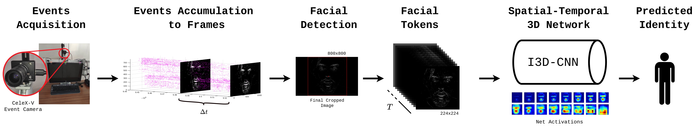

# Neuromorphic Event-based Face Identity Recognition

This repository contains the python scripts needed to prepare the dataset and the scripts used for training and testing the models used in the paper "Neuromorphic Event-based Face Identity Recognition".

|  |
|:--:|
| Full Framework (from Data Aquisition to Identity Prediction) |

  &nbsp;
  
## Table of contents
- [1. SETUP ENVIRONMENT](#1-setup-environment)
- [2. DATASET PREPARATION](#2-dataset-preparation)
  - [Download the Datasets](#download-the-datasets)
  - [Create Event Frames, Clips and train and test Lists](#create-event-frames-clips-and-train-and-test-lists)
- [3. TRAIN](#3-train)
  - [Train model](#train-model)
- [CITATION](#citation)

&nbsp;

## 1. SETUP ENVIRONMENT

Create an *anaconda3* virtual environment, build *Cython* package and create PATHS.json: (Assuming user is in base directory ```NebFIR/```)

```bash
source scripts/build_environment.sh nebfir
```

&nbsp;

## 2. DATASET PREPARATION

### Download the Datasets

Download the datasets to the `data/datasets/` folder or change the data path later. Contact us at `email@isr.uc.pt` to receive the datasets passwords.

  | DATASET | Number of Event Files | <div style="width:655px"></div> Structure |
  |:---:|:---:|:---:|
  | [NVFSD](https://isrucpt-my.sharepoint.com/:u:/g/personal/andre_graca_isr_uc_pt/Ean8_iZbUrxHpp4hi2918oAB-34Lg1kI8sAyqDtxksSfOA?e=zGghVG) | 436 | `NVFSD/Events/user<USER_ID>/task<TAKS_ID>/recording<RECORDING_ID>/pc.csv` |
  | [SynFED](https://isrucpt-my.sharepoint.com/:u:/g/personal/andre_graca_isr_uc_pt/ESnovcskxAtEu_o1-pAFshABZKhrDz4i_yDyTFkW6A0ZqQ?e=2rBpbi) | 6536 | `SynFED/Events/<REAL-FAKE>/user<USER_ID>/recording<RECORDING_ID>/pc.csv` |

<div align="center">

&nbsp;
<table>
<td>

```text
  NVFSD                                 SynFED                       
  └── Events                            └── Events                   
      ├── user000                           ├── deepfakes_v1         
      │   ├── task01                        │   ├── u0               
      │   │   ├── recording01               │   │   ├── r0           
      │   │   │   └── pc.csv                │   │   │   └── pc.csv   
      │   │   └── recording02               │   │   ├── r1           
      │   │       └── pc.csv                │   │   │   └── pc.csv   
     ... ...                               ... ... ...               
  ```

</td>
<td>
  
  | timestamp (µs) |   x   |   y   |
  | :------------: | :---: | :---: |
  |     40040      |  298  |  350  |
  |     49049      |  296  |  348  |
  |     57057      |  463  |  248  |
  |      ...       |  ...  |  ...  |
  
</td>

<tr>
<td align="center"> Example structure </td>
<td align="center"> Example of pc.csv </td>
</tr>
</table>

&nbsp;
<div align="left">

### Create Event Frames, Clips and train and test Lists

```bash
bash scripts/prepare_datasets.sh
```

**NOTE**: For more detailed information on the data preparation with different options please check the [README_extra.md](./docs/README_extra.md#nebfir-extra) in the [events and clips creation](./docs/README_extra.md#create-event-frames-and-clips) and in the [lists creation](./docs/README_extra.md#create-lists) section.

|  |
|:--:|
| **Grayscale deepfake video generated with the [S3DFM](https://groups.inf.ed.ac.uk/trimbot2020/DYNAMICFACES/) [[paper]](https://www.pure.ed.ac.uk/ws/files/79659390/3D_Visual_Passcode.pdf) Dataset, using the [FOMMIA](https://github.com/AliaksandrSiarohin/first-order-model) [[paper]](https://arxiv.org/pdf/2003.00196.pdf) and the corresponding AETS events representation with dT=40ms generated with the [V2E](https://github.com/SensorsINI/v2e) [[paper]](https://arxiv.org/pdf/2006.07722.pdf)**|

&nbsp;

## 3. TRAIN

If the option `--gen_config` to automaticaly generate a configuration file after creating a list was not chosen in *create_lists.py*, add a configuration file to `configs/` (can specify all / some parameters according to `nebfir/config/base_cfg.yml`):

### Train model

```bash
bash scripts/train.sh
```
<!-- python runner.py --device cuda --conf configs/config-0.yml -d -t -->

**NOTE**: For more detailed information on training a model with different options please please check the [README_extra.md](./docs/README_extra.md#nebfir-extra) in the [Train](./docs/README_extra.md#train) section.

&nbsp;

## CITATION

If you find this repository useful please consider citing our work.
<!-- ```bibtex
@article{,
  author = {Gonçalo Moreira, André Graça, Bruno Silva, Pedro Martins, Jorge Batista},
  title = {Neuromorphic Event-based Face Identity Recognition},
  journal = {26TH International Conference on Pattern Recognition}
  year = {2022},
  month = aug,
  note = {Unpublished paper},
}
``` -->

